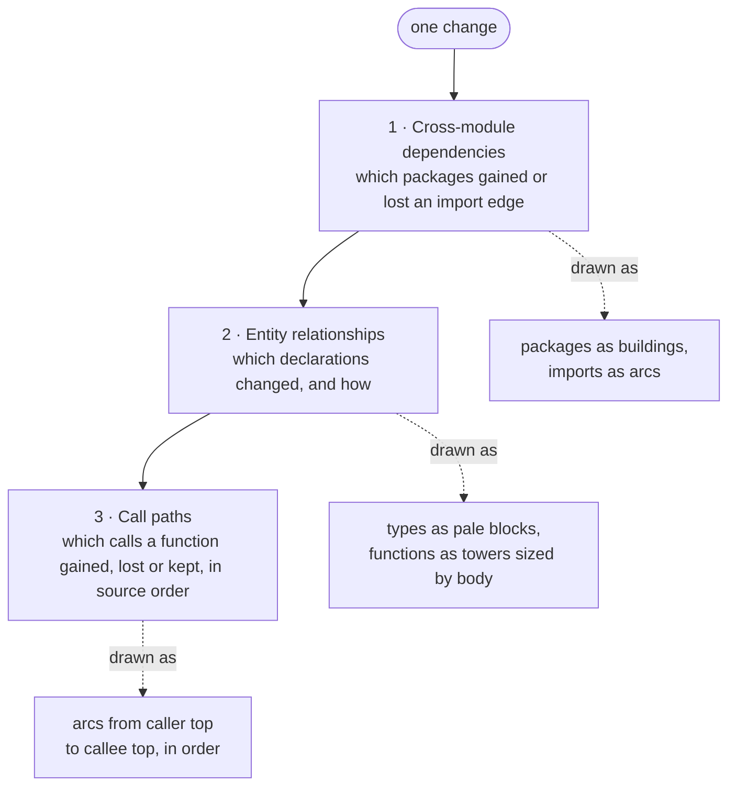

# citydiff

**A 3D diff for Go and Rust.** Read one change from the outside inward, at three levels:

1. **Cross-module dependencies** — which packages gained or lost an import edge.
2. **Entity relationships** — which declarations changed, and how.
3. **Call paths** — which calls a function or method gained, lost, or kept, in source order.

The outer level *places* the change. The inner level shows what the code *does* differently.
All three are views of the same diff.



The city is the code. Packages are buildings; a package's sub-packages stand on its roof.
A **type** is a wide pale block holding its methods. A **function** or **method** is a tower
whose **height is its body size**. A **call** is one smooth arc from the top of the caller to
the top of what it calls. Colour marks change: green is added, red is deleted, yellow is
modified; arcs that stayed are cyan.

## Install

```sh
curl -fsSL https://raw.githubusercontent.com/naqerl/citydiff/main/install.sh | sh
```

The installer resolves the latest [release](https://github.com/naqerl/citydiff/releases),
verifies its published `sha256`, installs the binary to `~/.local/bin`, and writes two agent
skills: `citydiff` to `~/.agents/skills/citydiff`, and `citydiff-tour` (writing [tours](#tours))
to `~/.agents/skills/citydiff-tour`, plus `~/.claude/skills` and `~/.cursor/skills` when those
agents are installed. Re-running it is safe: it only rewrites files it owns and leaves a
`SKILL.md` it did not write alone. It also supports env vars and flags:

```sh
# a specific tag
curl -fsSL https://raw.githubusercontent.com/naqerl/citydiff/main/install.sh | sh -s -- --tag=v0.0.2

# choose where things go
BIN_DIR=~/.local/bin SKILLS_DIR=~/.agents/skills AGENTS_MD=~/AGENTS.md \
  sh install.sh

# skip the agent skills / don't touch PATH
sh install.sh --no-skills --no-path

# only the tour skill, into chosen skill dirs
curl -fsSL https://raw.githubusercontent.com/naqerl/citydiff/main/install.sh | \
  SKILL_TARGETS="$HOME/.claude/skills $HOME/.agents/skills" sh -s -- --skills-only

# build the binary from source (git, go and a C compiler) instead of a release
sh install.sh --from-source

# remove binary, skill and AGENTS.md pointer
sh install.sh --uninstall
```

## Quick start

Parse a file or a project tree (no diff — one snapshot):

```sh
citydiff -path ./service/flashcard/flashcard.go -json
citydiff -path . -json | jq '.[] | {path, decls: (.entries | length)}'
```

Diff a commit range inside a git repository:

```sh
cd ~/src/myrepo
citydiff -path . -range main~5..main            # human-readable
citydiff -path . -range main~5..main -json      # machine-readable
citydiff -path . -range v0.0.1...v0.0.2         # three-dot: merge-base vs right
```

Serve the 3D viewer (`-view` never exits — run it in a terminal or in the background):

```sh
citydiff -path ~/src/myrepo -range main~5..main -view -addr 0.0.0.0:8787
```

then open `http://localhost:8787`. The page reads the scene from `GET /scene.json`; the
viewer assets are embedded in the binary.

## Command line

```
citydiff [-json | -scene | -view [-tour file]] -path file-or-directory [-range A..B]
citydiff nodes [-path dir] [-range A..B] [-changed] [-kind k] [-json]
citydiff tour validate|serve [-path dir] [-range A..B] [-json] [-addr host:port] tour.json
citydiff tour schema
```

| Flag | Meaning |
| --- | --- |
| `-path`, `-p` | a Go or Rust file, or a directory tree to walk. Required. |
| `-range`, `-r` | `A..B` compares those two commits; `A...B` compares their merge base with `B` (how `git diff` treats a three-dot range). An empty side means `HEAD`. |
| `-json` | print machine-readable entries instead of text. |
| `-scene` | print the scene graph the viewer draws, instead of text. |
| `-view` | serve the 3D viewer over HTTP (long-running). |
| `-addr` | listen address for `-view` (default `127.0.0.1:8787`). |
| `-tour` | with `-view`, a [tour](#tours) script the viewer loads and plays. |

Notes:

- With `-range`, `-path` must live inside a **git checkout**: the nearest parent directory
  containing `.git` is the repository, and the tree at each ref is read straight from the
  object database with [go-git](https://github.com/go-git/go-git) — the working tree does not
  need to be checked out at either ref.
- Without `-range`, the filesystem tree is parsed and there is no diff. The viewer says so.
- Only Go and Rust source files are parsed. A commit that touches only other files (`*.js`,
  `*.sql`, …) produces an empty diff.
- `-json`, `-scene` and `-view` are mutually exclusive; the first one given wins.

## The 3D view

Two modes, toggled by the `Overview` / `Changes` buttons, `m`, or keys `1` and `2`:

- **Overview** — the city as it is: packages, their sub-packages, types and towers, and the
  cross-module dependency arcs between packages.
- **Changes** — the same city with the diff laid on top: added and deleted towers appear,
  changed ones take the change colour, and changed cross-module calls are drawn.

Selecting a package descends into it; selecting a tower opens its call path. The sidebar
shows the change for whatever is selected, with the resolved calls in source order.

The viewer keeps a **vim-style jump list** of every node you select. Press `o` to step to
an older selection and `i` to step to a newer one — the same directions as vim's `<C-o>`
and `<C-i>`. Selecting a new node after going back truncates the forward tail, exactly as
vim does. The sidebar note shows your position (`jump 2/5`) once the list has more than one
entry.

| Key | Action |
| --- | --- |
| `/` | search for a package or function |
| `w a s d`, arrows | move the camera |
| `q` `e` | orbit |
| `-` `+` | zoom |
| `drag` / `scroll` | orbit / zoom with the mouse |
| `click` | enter a package, open a tower |
| `enter` | open a function |
| `esc` | go back |
| `o` `i` | jump back / forward through the selection history |
| `b` | show / hide the left sidebar |
| `t` | show / hide the tour sidebar |
| `0` | reset the view |
| `m`, `1`, `2` | overview / changes |
| `space` | tour: play / pause |
| `,` `.` | tour: previous / next step |
| `?` | legend |

## Tours

A tour is a versioned JSON script over the scene of one commit range: an ordered list of
steps the viewer plays. It is meant to be written by an agent (see the `citydiff-tour`
[skill](skills/citydiff-tour/SKILL.md)) or by hand. The schema is
[`lib/tour/tour.schema.json`](lib/tour/tour.schema.json) (`citydiff tour schema` prints it), and
[`examples/barse-flashcard-versions.tour.json`](examples/barse-flashcard-versions.tour.json)
is a full example.

```json
{
  "version": 1,
  "title": "Flashcard versions",
  "range": "dbdafc00..061e9aed",
  "steps": [
    { "title": "The whole change", "note": "Markdown **note**.", "mode": "changes", "camera": "overview" },
    { "title": "The generator", "select": "service/flashcard/generator" },
    { "title": "Picking the final", "focus": "review.Service.SelectFinal", "code": "review.Service.SelectFinal" },
    { "title": "Handler to view", "path": { "from": "handler.handlePostSelectFinal", "to": "meetings/view.versionBar" } },
    { "title": "Storage", "highlight": ["db.Queries.SetGenerationFinal", "generator.FinalVersion"], "dim": false }
  ]
}
```

| Step field | Effect |
| --- | --- |
| `title` | required; the roadmap entry and note heading |
| `note` | markdown shown in the note panel (top right) |
| `duration` | seconds autoplay stays on the step (default 8) |
| `mode` | `changes` or `full` |
| `select` | select a package or external import and fly to it |
| `focus` | open a function's or method's call focus; select a type, variable or package |
| `highlight` | light several nodes and the calls between them |
| `path` | `{from, to}`: light the shortest resolved call path between two functions, with its arcs |
| `dim` | with `highlight`/`path`, `false` keeps the rest of the city bright |
| `camera` | `overview`, `top`, `fit` or `close` |
| `zoom` | multiply the camera distance (`0.5` is twice as close) |
| `code` | show a declaration's source under the note, as a line diff when it changed |

Names are what you would write: a package path or a unique tail of it (`barse/db`, `db`), a Go
declaration (`pkg/path.Func`, `pkg.Type.Method`, `Type.Method`), a Rust item
(`crate::mod::f`, `<T as Trait>::m`), or a scene id. A name matching several nodes is an error
that lists the candidates; an unknown name comes with suggestions.

```sh
citydiff nodes -path ~/src/barse -range dbdafc00..061e9aed -changed       # the names to use
citydiff tour validate -path ~/src/barse tour.json                         # resolve every name; exit 1 on problems
citydiff tour validate -path ~/src/barse tour.json -json                   # the resolved script
citydiff tour serve -path ~/src/barse -addr 127.0.0.1:8787 tour.json       # validate, then serve the viewer with it
```

`-range` defaults to the script's own `range`; ranges are compared by commit, so abbreviated
hashes and refs match. A running viewer also plays `?tour=<url>` (fetched by the browser) and a
script dropped onto the page; the server resolves those through `POST /api/tour` with the same
checks as the CLI.

The tour plays in a **right sidebar** that mirrors the left one: the tour title and range,
the step's note and code, the roadmap (click a step to jump; the current one is marked), and
the player controls at the bottom. **space** plays and pauses (autoplay uses the durations),
**,** and **.** step back and forward, and **t** hides and shows the sidebar the way **b** does
the left one. Dragging or clicking in the city pauses autoplay. The camera centres and fits in
the space between the two sidebars, and re-centres when either one is shown or hidden.

Loading a tour moves the viewer to the tour's `range`: `tour serve` starts on it, `-view -tour`
switches to it at startup, and a `?tour=` or dropped script makes the server rebuild the scene
for that range (when it differs, compared by commit) and the page reload into it, so the left
sidebar shows the tour's changes. A range that does not resolve in the repository is reported
in the tour sidebar and leaves the current scene alone.

## JSON output

**A parsed snapshot** (`-json`, no `-range`) — one object per file:

```json
[{"path": "lib/entity.go", "package": "lib", "importPath": "citydiff/lib", "module": "citydiff",
  "entries": [{"kind": "function", "entry": {"name": "…", "calls": [{"expr": "q.db.ExecContext"}]}}]}]
```

**A diff** (`-json -range`) — one object per file, `action` = `added` / `modified` / `deleted`,
each with one entry per declaration change:

```json
[{"path": "db/flashcard.sql.go", "action": "modified",
  "changes": [
    {"action": "added",
     "right": {"kind": "method", "entry": {"name": "ClearGenerationFinal",
               "parameters": [{"name": "ctx", "type": "context.Context"}],
               "returnArgs": [{"type": "error"}],
               "calls": [{"expr": "q.db.ExecContext"}]}}},
    {"action": "modified", "kind": "function", "name": "serve",
     "edits": [{"field": "bodyHash", "left": "9373749d…", "right": "26138d04…"},
               {"field": "bodyBytes", "left": 410, "right": 408}]}
  ]}]
```

- `kind` — `import`, `type`, `variable`, `function`, or `method`.
- `entry.calls` — direct calls recorded on the declaration, in source order, including calls
  inside nested function literals. `expr` is the callee as written. A `ref` is filled in when
  the callee is declared inside the same snapshot; a call to something outside it stays
  **unresolved** and is kept — the diff decides which calls matter.
- `bodyHash` / `methodsHash` — the signal that a body changed beyond its call list.
  `bodyBytes` says whether it grew or shrank.
- `edits[].field` — one of `fields`, `parameters`, `returnArgs`, `receiver`, `bodyHash`,
  `bodyBytes`, `calls`, `methodsHash`.

`-scene` prints the viewer's own graph (`{module, root, diff, packages}`), and `-view` serves
that same document at `/scene.json`. A package is a `{id, name, dir, parent, change, entities[],
deps[]}` node; an entity carries `kind`, `change`, `bodyBytes`, and aligned `calls[]` steps.

## How it works

The core is small and language-agnostic. A parser turns a **stream of files** into `Entity`
values: imports, types, variables, functions, methods, each with its direct calls in source
order. That stream is the **closed world** for the parse — resolution never depends on file
order, and a declaration in the first file can resolve a call in the last. Collect the stream,
then fill refs.

Two sources produce the same stream:

- **filesystem** — walks a file or directory tree (`lib/files`);
- **git** — reads the tree at each ref of a range with go-git (`lib/git`).

Each side of a range is a separate stream and a separate parse. `lib/diff` pairs files by path
and declarations by the same identity used for a single file, so a name shared by two files
stays two declarations. Body hashes stay the signal that a body changed beyond its call list.
`lib/scene` folds the result into the city the viewer draws.

Supported languages today: **Go** and **Rust** (`lib/parser/go`, `lib/parser/rust`), both via
[tree-sitter](https://tree-sitter.github.io/). Adding a language means adding a parser package
that yields the same `Entity` values — nothing downstream changes.

## Build from source

Requires **Go 1.27+** and a C toolchain: the parsers link the tree-sitter C bindings, so
**CGO is mandatory** (`CGO_ENABLED=0` fails with *"build constraints exclude all Go files"*).

```sh
git clone git@github.com:naqerl/citydiff.git
cd citydiff
make vet
CGO_ENABLED=1 go build -o citydiff ./cmd/cli
./citydiff -path . -json > /dev/null
```

`make vet` runs `go vet ./...`; `go fmt` via `make fmt`. The release workflow builds natively
per runner (linux/amd64, darwin/arm64) instead of cross-compiling, because of CGO.

## Releases

`.github/workflows/release.yml` runs vet + build + a smoke test on every push and PR to `main`.
On a `v*` tag it also publishes a GitHub Release with
`citydiff-<tag>-<os>-<arch>.tar.gz` per platform plus `checksums.txt`.

## Repository map

| Path | What |
| --- | --- |
| `AGENTS.md` | design intent and invariants |
| `cmd/cli/main.go` | flags, JSON shapes, the `-view` HTTP server |
| `lib/parser.go`, `lib/parser/` | source → `Entity` values (tree-sitter) |
| `lib/parser/go`, `lib/parser/rust` | per-language parsers |
| `lib/diff/` | comparing two parses at all three levels |
| `lib/scene/` | folding a diff into the viewer's scene graph |
| `lib/git/` | git source: reads trees at refs via go-git |
| `lib/files/` | filesystem source |
| `view/` | embedded browser viewer (three.js) |
| `lib/tour/` | tour scripts: schema, name resolution, validation, call paths, code snippets |
| `cmd/cli/tour.go` | the `nodes` and `tour` subcommands and the tour HTTP endpoints |
| `skills/citydiff-tour/` | the agent skill for writing tours |
| `examples/` | example tours |
| `install.sh` | one-command install of the binary and the agent skills |

## Known limitations

- The git source uses go-git and does not follow a **linked worktree** `.git` file. Run
  `-range` from the main checkout (a normal checkout whose `.git` is a directory).
- Only Go and Rust files are parsed; other file types are invisible to the diff.
